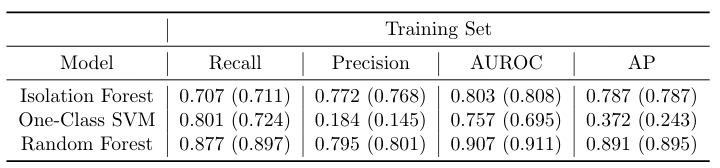
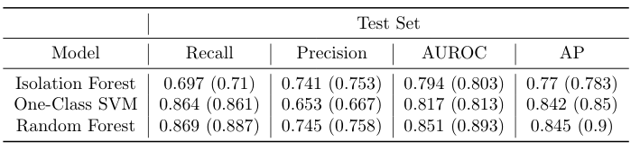
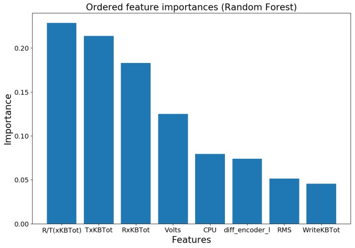
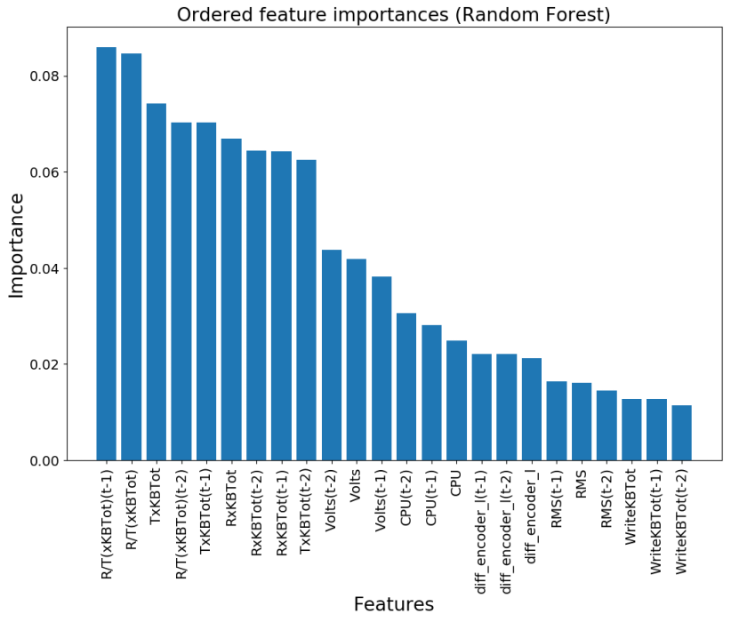

# Anomaly Detection on a Robotic Vehicle Using Machine Learning

## Overview

We are interested in detecting attacks on a robotic vehicle using machine learning algorithms. We pose this as a binary classification task: Given the vehicle's state at time `t` (and possibly previous states `t-1`, `t-2`), the task is to classify whether the vehicle is under attack (Anomaly) or not (Normal). The goal is to develop machine learning algorithms using primarily unsupervised methods.

Although it is an unsupervised classification task, it is possible to approach it using semi-supervised and/or supervised learning. This can be achieved by first training an unsupervised model, and then labeling the training examples that correspond to the most confident predictions of the model. Using these training examples with "noisy" labels, we can train a semi-supervised or even a supervised model. The idea is that, although the model will generate several wrong labels, learning a decision function can be quite robust to wrongly labeled examples, since most of the signal is still present in the data. We describe the above process in three steps:

1) Unsupervised: We start with an unsupervised model without any knowledge of the class labels. For that, we train an Isolation Forest model.
2) Semi-supervised: We label the top-k confident examples predicted as "Normal" from the unsupervised model. Then, we train a novelty detection (semi-supervised) algorithm, namely, One-Class SVM, on this noisy training set in order to learn the distribution of the "Normal" class. For a new (unseen) example, the model predicts whether it is generated from the training distribution or not, i.e. classifies the example as "Normal" or "Anomaly".
3) Supervised: This is similar to 2), but we obtain the top-k confident examples from both classes ("Normal" and "Anomaly"). Finally, we train a supervised model, such as a Random Forest, on the fully labeled training set.    

## Models
We train the following models: Isolation Forest (unsupervised), One-Class SVM (semi-supervised), and Random Forest (supervised). Additionally, we employ two variants of these models.    

1) Using only time step `t` for each variable, i.e. no temporal information. For example, using variables `X1(t)`, `X2(t)`.
2) Using information from previous steps by constructing lagged versions for each variable for two time steps. For example, `X1(t)`, `X1(t-1)`, `X1(t-2)`, `X2(t)`, `X2(t-1)`, `X2(t-2)`.

### Feature Engineering
We construct two new features    
1) `Volts` = `Watts` / `Amps` in order to model the interaction between `Watts` and `Amps`. These two variables are replaced by `Volts`.
2) `R/T(xKBTot)` = (`RxKBTot + 1`) / (`TxKBTot + 1`) to model the ratio between received and transmitted network traffic rate.

### Feature Transformation    
All features are scaled to have zero mean and unit variance.

## Evaluation
We evaluate the models using the following metrics
1) Recall
2) Precision
3) Area under the Receiver Operating Characteristic (ROC) curve - AUROC
4) Area under the Precision-Recall curve (Average Precision) - AP

## Results

Training set and test set results are shown in the following tables. Results for models with lagged variables are included in parentheses. We observe that test set performance increases by increasing model supervision during training. Namely, Random Forest outperforms both One-Class SVM and Isolation Forest across all metrics, and One-Class SVM outperforms Isolation Forest across most metrics. Finally, the addition of lagged variables increases performance further, particularly for Isolation Forest and Random Forest. This is expected, since forest models usually perform well on high-dimensional data.  




### Feature Importances
We provide feature importances as produced by the random forest models. The constructed feature, `R/T(xKBTot)`, is considered the most important. The other constructed feature, `Volts`, is also considered quite important.




## How to Use

### Requirements   
`Python 3.x`. For packages, see `requirements.txt`.

Clone or download this repository.
```
$ git clone https://github.com/micts/anomaly-detection-robotic-vehicle.git
```
Make sure to copy the dataset file, `vulnerable_robot_challenge.csv`, in the folder of this repository.

### Model Training and Evaluation
We run `main.py` to train and evalute the models. 
```
python main.py -p <path_to_csv_file>
```
There are a few optional input arguments we can specify.     
`-lv`, `--lag_variables`,  Create a lag version of two time steps for each variable.    
`-nv`, `--no_verbose`,    No verbose does not print evaluation results.    
`-sr`, `--save_results`,  Save results in a pickle file.     
`-sm`, `--save_models`,   Save models and transformations.    
`-fi`, `--feature_importances`, Plot and save feature importances from random forest model.    
  
For help, type
```
python main.py -h <or> --help    
```   

Results are saved under `results/`. Trained models and transformations are saved under `models/`. Finally, feature importances as produced by the random forest model are saved under `feature_importances/`.

#### Using Docker
In order to train and evaluate the models using Docker, we build a Docker image that contains all required packages (see `requirements.txt`). By building the image, we run `main.py`. This ensures that 1) the models are trained and evaluated in an isolated environment (container) and 2) the results (e.g. saved models and feature transformations) will be available to all containers initialized from the built image. This will be useful later when we serve our models as a REST API within Docker.

To train and evaluate the models using Docker
```
$ docker build -t <name_for_image>:<tag> .
```
For example,
```
$ docker build -t my_image:v1 .
```
The input arguments to `main.py` can be modified in the Dockerfile. 

In order to move the results produced by `main.py` to the host (local machine), we first need to initialize a container
```
$ docker run --name my_container my_image:v1
```
Next, we copy the data we need from the container to our local machine. For example, to copy the `results/` folder
```
$ docker cp my_container:anomaly_detection_app/results/ <path_on_host>
```

### REST API
We deploy the trained models as a REST API using Docker and Flask. First, we build a docker image from the Dockerfile using `$ docker build -t <name_for_image>:<tag> .` For example, 
```
$ docker build -t my_image_api:v1 .    
```    
The above command will install all required dependencies. As described above, by building the image, `main.py` will be executed in order to train and save the models. Saved models and feature transformations will be available to all containers initialized by the built image, so that we access them througth the API.  

To run the web server
```
$ docker run -it -p 5000:5000 my_image_api:v1 python3 api.py -mn model_name
```
where we subsitute `model_name` with one of the following: `isolation_forest` (unsupervised), `one-class_svm` (semi-supervised), or `random_forest` (supervised). We can also use the optional input argument `-lv` to specify that we want to perform inference using a model with lagged variables. For instance, run the server to perform inference using the trained Random Forest model with lagged variables
```
$ docker run -it -p 5000:5000 ad_image_test:v1 python3 api.py -mn random_forest -lv
```
A requests for prediction can be send by running a shell script under `/requests`. The script contains a curl command that queries the service using a new example (in JSON format) to be predicted. For example

```
$ requests/request_lag_models.sh
```
or    
```
$ requests/request.sh
```
for a model without lagged variables. 

The API should output the model's prediction, 0 - Normal or 1 - Anomaly, in JSON format.
